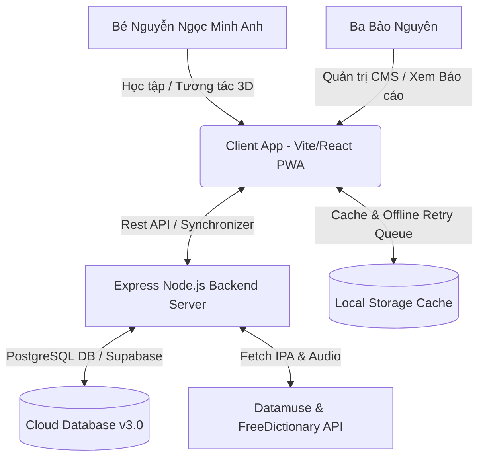
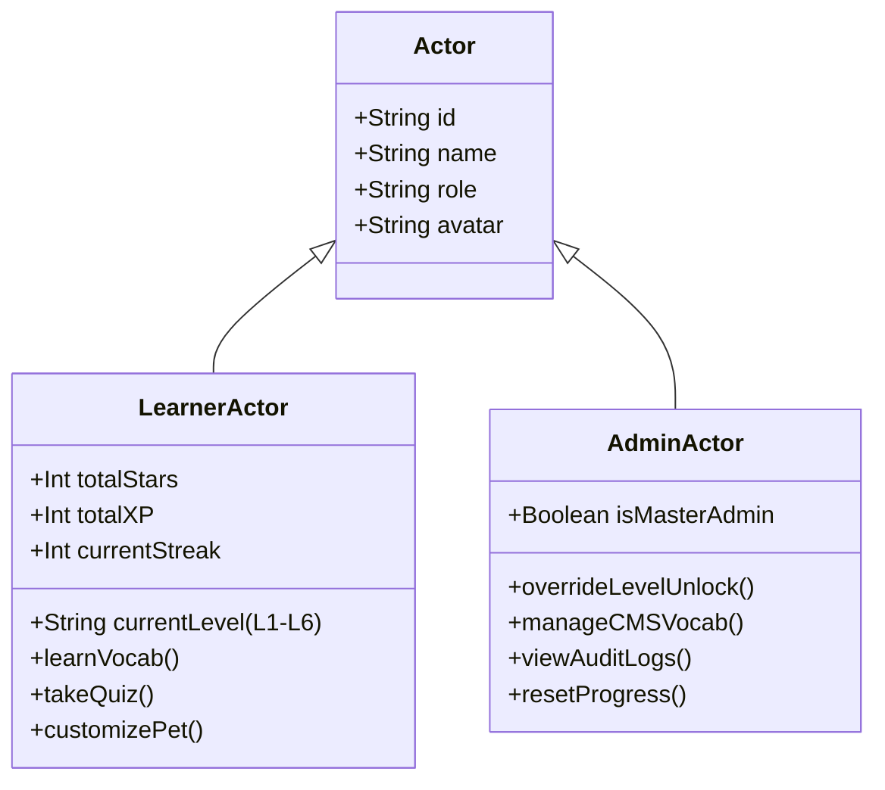
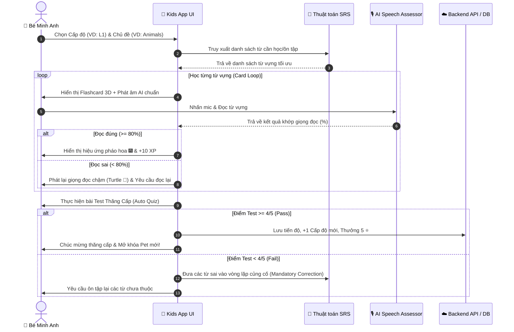
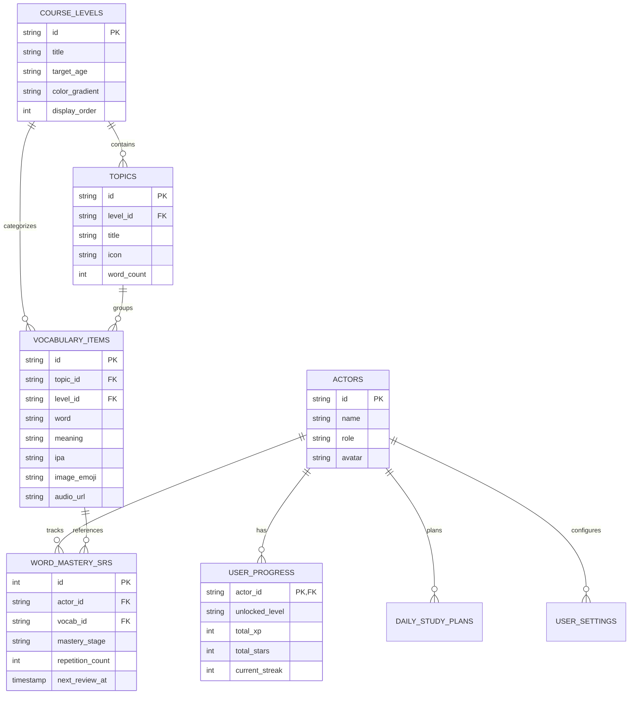
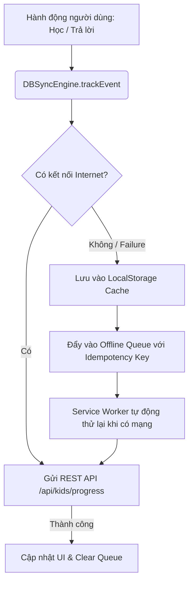

# 🌟 TÀI LIỆU NGHIỆP VỤ & ĐẶC TẢ CHỨC NĂNG SIÊU CHI TIẾT (BRD / FSD)
## HỆ THỐNG NỀN TẢNG HỌC TIẾNG ANH THÍCH ỨNG - KIDS ENGLISH LEARNING AGENT (V3.0 ENTERPRISE EDITION)
**Dành riêng cho Bé:** Nguyễn Ngọc Minh Anh 🦄  
**Quản trị viên & Phụ huynh:** Ba Bảo Nguyên 👨‍💼  
**Ngày cập nhật:** 15/08/2026  
**Phiên bản hệ thống:** 3.0.0 (Adaptive Automation & Dual-Actor Security)  

---

> [!IMPORTANT]
> **Tuyên bố Sứ mệnh Nghiệp vụ:**  
> Hệ thống *Kids English Learning Agent* được thiết kế nhằm xây dựng một môi trường học tập Tiếng Anh cá nhân hóa cao độ, kết hợp trí tuệ nhân tạo (AI Agent), thuật toán lặp lại ngắt quãng (Spaced Repetition System - SRS), giao diện trực quan 3D Ultra-Cute và cơ chế quản trị bảo mật 2 Tác nhân (Dual Actor). Sản phẩm vừa đáp ứng mục tiêu giáo dục sớm tự động hóa cho bé, vừa cung cấp công cụ giám sát toàn diện cho phụ huynh.

---

## 📑 MỤC LỤC
1. [TỔNG QUAN DỰ ÁN & MỤC TIÊU NGHIỆP VỤ](#1-tổng-quan-dự-án--mục-tiêu-nghiệp-vụ)
2. [KIẾN TRÚC TÁC NHÂN & BẢO MẬT (DUAL-ACTOR SYSTEM)](#2-kiến-trúc-tác-nhân--bảo-mật-dual-actor-system)
3. [KHUNG CHƯƠNG TRÌNH HỌC 6 CẤP ĐỘ (L1 - L6 LEARNING FRAMEWORK)](#3-khung-chương-trình-học-6-cấp-độ-l1---l6-learning-framework)
4. [QUY TRÌNH HỌC TẬP TỰ ĐỘNG & THÍCH ỨNG (AUTOMATED LEARNING LOOP)](#4-quy-trình-học-tập-tự-động--thích-ứng-automated-learning-loop)
5. [ĐẶC TẢ CHI TIẾT CÁC PHÂN HỆ TÍNH NĂNG (FEATURE SPECIFICATIONS)](#5-đặc-tả-chi-tiết-các-phân-hệ-tính-năng-feature-specifications)
   - 5.1. Flashcards & Poster Từ Vựng 3D Tương Tác
   - 5.2. AI Speech Assessor (Chấm Điểm Phát Âm Chuẩn Voice)
   - 5.3. Bài Test Đánh Giá Thăng Cấp (Level Up Test Engine)
   - 5.4. Tra Cứu Từ Điển Longman IPA & Fun Facts
   - 5.5. Tự Động Thu Thập Từ Vựng Trực Tuyến (Online Vocab Fetcher)
   - 5.6. Trung Tâm Trò Chơi Học Tập (Mini-Games Hub)
   - 5.7. Sổ Tay Từ Vựng & Kế Hoạch Học Tập Ngày (Vocab Book & Daily Plan)
   - 5.8. Hệ Thống Pet & Trang Phục Avatar Tùy Chỉnh
   - 5.9. Trình Phát Nhạc Nền 3D (Background Music Player & Canvas Themes)
   - 5.10. Thông Báo Nhắc Nhở Thông Minh (Native PWA Push Notifications)
6. [PHÂN HỆ QUẢN TRỊ & BÁO CÁO PHỤ HUYNH (PARENT & ADMIN PORTAL)](#6-phân-hệ-quản-trị--báo-cáo-phụ-huynh-parent--admin-portal)
7. [KIẾN TRÚC DỮ LIỆU & SƠ ĐỒ CƠ SỞ DỮ LIỆU (DATABASE SCHEMA & DATA MODELS)](#7-kiến-trúc-dữ-liệu--sơ-đồ-cơ-sở-dữ-liệu-database-schema--data-models)
8. [KIẾN TRÚC KỸ THUẬT & ĐỒNG BỘ DỮ LIỆU (TECHNICAL ARCHITECTURE & OFFLINE SYNC)](#8-kiến-trúc-kỹ-thuật--đồng-bộ-dữ-liệu-technical-architecture--offline-sync)
9. [YÊU CẦU PHI CHỨC NĂNG (NON-FUNCTIONAL REQUIREMENTS - NFR)](#9-yêu-cầu-phi-chức-năng-non-functional-requirements---nfr)
10. [MA TRẬN KIỂM THỬ & TIÊU CHÍ NGHIỆM THU (TESTING & ACCEPTANCE MATRIX)](#10-ma-trận-kiểm-thử--tiêu-chí-nghiệm-thu-testing--acceptance-matrix)

---

## 1. TỔNG QUAN DỰ ÁN & MỤC TIÊU NGHIỆP VỤ

### 1.1 Bối Cảnh & Mục Tiêu Nghiệp Vụ
Dự án **Kids English Learning Agent** là nền tảng học tiếng Anh thông minh thế hệ mới, được thiết kế tối ưu trên môi trường Mobile-First và PWA (Progressive Web App). Mục tiêu cốt lõi:
- **Tối ưu hóa thời gian học tập:** Giúp bé Nguyễn Ngọc Minh Anh tiếp thu từ vựng tự nhiên qua các bài học ngắn 10–15 phút mỗi ngày.
- **Tăng cường phản xạ phát âm:** Sử dụng công cụ AI Speech Recognition đánh giá chuẩn IPA và ngữ điệu giọng đọc (Male Voice / Slow Turtle Voice).
- **Gamification (Trò chơi hóa):** Biến việc học thành hành trình khám phá thế giới phép thuật, tích lũy Sao ⭐, điểm kinh nghiệm (XP), mở khóa linh vật Pet và trang phục Avatar.
- **Tự động hóa toàn diện:** Tự động gọi API từ điển quốc tế (Datamuse & FreeDictionary API) để mở rộng từ vựng và tự động sinh bài tập trắc nghiệm đa dạng (Listening, Spelling, Matching).

### 1.2 Môi Trường Vận Hành & Khả Năng Mở Rộng


---

## 2. KIẾN TRÚC TÁC NHÂN & BẢO MẬT (DUAL-ACTOR SYSTEM)

Hệ thống vận hành dựa trên cơ chế phân quyền bảo mật 2 Tác nhân riêng biệt:



### 2.1 Tác Nhân Học Viên (👧 Bé Nguyễn Ngọc Minh Anh - `student`)
- **Giao diện hiển thị:** Chế độ Ultra-Cute UI với các mảng màu rực rỡ, hạt sinh động (Particles 3D), linh vật hoạt hình di chuyển linh hoạt.
- **Quyền hạn hạn chế:** Không được sửa/xóa cơ sở dữ liệu từ vựng; không thể cưỡng chế mở Cấp độ nếu chưa đạt điểm bài Test thăng cấp.
- **Tính năng trọng tâm:** Học Flashcard, Nghe phát âm, Thu âm luyện đọc, Làm bài test, Đổi quà Pet/Avatar, Xem lộ trình học tập.

### 2.2 Tác Nhân Quản Trị / Phụ Huynh (👨‍💼 Ba Bảo Nguyên - `admin`)
- **Giao diện quản trị:** Modal CMS Content Authoring, Parent Dashboard Modal.
- **Quyền hạn cao cấp (Super Admin):**
  1. Thêm / Sửa / Xóa từ vựng trực tiếp trong kho cơ sở dữ liệu.
  2. Bật/Tắt chế độ Cưỡng chế Mở Cấp độ (Force Unlock Level L1 → L6).
  3. Cấu hình hệ thống âm thanh, chọn chủ đề background 3D mặc định, điều chỉnh âm lượng.
  4. Xem nhật ký kiểm toán (Audit Logs), lịch sử sự kiện (Analytics Events) và khôi phục dữ liệu từ Thùng rác (Trash Can).
  5. Đặt mục tiêu học hàng ngày (Daily Goal Minutes) và theo dõi báo cáo chi tiết.

---

## 3. KHUNG CHƯƠNG TRÌNH HỌC 6 CẤP ĐỘ (L1 - L6 LEARNING FRAMEWORK)

Khung chương trình được chuẩn hóa theo độ tuổi và năng lực ngôn ngữ thực tế:

| Cấp Độ (Level ID) | Tên Cấp Độ | Độ Tuổi Mục Tiêu | Gradient UI Visual | Mục Tiêu Ngôn Ngữ & Kỹ Năng Cốt Lõi | Số Từ Mẫu |
| :--- | :--- | :--- | :--- | :--- | :---: |
| **L1** | Khởi Động (Starter) | 3 - 5 tuổi | `from-pink-500 to-rose-500` | Nhận diện chữ cái, màu sắc, động vật quen thuộc, phát âm từ đơn, ghép nối hình ảnh. | 100+ từ |
| **L2** | Vượt Sóng (Explorer) | 5 - 7 tuổi | `from-cyan-500 to-blue-500` | Quy tắc ghép vần (Phonics), từ vựng trường học, gia đình, câu lệnh cơ bản. | 120+ từ |
| **L3** | Bứt Phá (Adventure) | 7 - 9 tuổi | `from-amber-500 to-orange-500` | Giao tiếp câu ngắn, miêu tả đồ vật, trạng thái cảm xúc, hoạt động hàng ngày. | 150+ từ |
| **L4** | Chinh Phục (Challenger) | 9 - 11 tuổi | `from-emerald-500 to-teal-500` | Từ vựng khoa học tự nhiên, vũ trụ, phương tiện giao thông, đọc hiểu đoạn văn ngắn. | 180+ từ |
| **L5** | Thành Thạo (Master) | 11 - 13 tuổi | `from-purple-500 to-indigo-500` | Công nghệ, kỹ năng sống, viết đoạn văn miêu tả, tư duy phản biện ngôn ngữ. | 200+ từ |
| **L6** | Tài Năng Academic | 13 - 15+ tuổi | `from-yellow-400 to-amber-600` | Từ vựng học thuật, ngữ pháp chuyên sâu, kỹ năng thuyết trình & hội nhập quốc tế. | 250+ từ |

---

## 4. QUY TRÌNH HỌC TẬP TỰ ĐỘNG & THÍCH ỨNG (AUTOMATED LEARNING LOOP)

### 4.1 Sơ Đồ Luồng Học Tự Động (Adaptive Loop Diagram)


### 4.2 Thuật Toán Ghi Nhớ Ngắt Quảng (Spaced Repetition System - SRS)
Thuật toán tự động phân loại mức độ ghi nhớ của từng từ vựng dựa trên lịch sử tương tác:

- **Công thức tính khoảng thời gian ôn tập ($I_{next}$):**
  $$I_{next} = I_{current} \times \text{EaseFactor}$$
  - Nếu câu trả lời chính xác ($\text{Accuracy} \ge 80\%$): 
    $$\text{EaseFactor} = \min(3.0, \text{EaseFactor} + 0.1)$$
  - Nếu câu trả lời sai ($\text{Accuracy} < 80\%$): 
    $$I_{next} = 1 \text{ ngày}, \quad \text{EaseFactor} = \max(1.3, \text{EaseFactor} - 0.2)$$

- **4 Trạng Thái Ghi Nhớ Từ Vựng:**
  1. `WEAK` (Cần củng cố): Số lần sai nhiều hơn đúng.
  2. `FAMILIAR` (Đã quen mặt từ): Đã học 1–2 lần, tỉ lệ đúng > 60%.
  3. `REMEMBERED` (Đã nhớ): Đã trả lời đúng 3 lần liên tiếp.
  4. `MASTERED` (Thành thạo): Đã trả lời đúng $\ge 5$ lần, độ chính xác $\ge 90\%$.

---

## 5. ĐẶC TẢ CHI TIẾT CÁC PHÂN HỆ TÍNH NĂNG (FEATURE SPECIFICATIONS)

### 5.1 Flashcards & Poster Từ Vựng 3D Tương Tác
- **Mô tả:** Cho phép bé lật thẻ từ vựng 3D sống động với hình ảnh đại diện emoji/minh họa, phiên âm IPA chuẩn quốc tế.
- **Tính năng chính:**
  - Nút **Phát âm chuẩn AI (Standard Audio)**: Đọc từ vựng với chất giọng ấm áp.
  - Nút **Đọc chậm giọng Rùa (Turtle Slow Speech 🐢)**: Phát âm tách từng âm tiết giúp bé nghe rõ từng ngữ điệu.
  - 12 trang **Poster Từ Vựng Chi Tiết**: Giao diện dạng sách lật cho phép xem toàn bộ bộ từ vựng theo danh mục chủ đề.

### 5.2 AI Speech Assessor (Chấm Điểm Phát Âm Chuẩn Voice)
- **Mô tả:** Đánh giá khả năng nói của bé bằng Web Speech API tích hợp trực tiếp trên trình duyệt.
- **Quy trình hoạt động:**
  1. Bé nhấn vào biểu tượng Micro 🎙️.
  2. Trình duyệt thu âm phát âm tiếng Anh của bé trong 4 giây.
  3. Hệ thống so sánh chuỗi ký tự thu nhận được với từ gốc (`targetWord`).
  4. Trả về điểm phần trăm trùng khớp (Confidence score) và hiển thị phản hồi:
     - **Match 100%:** *"Xuất sắc! Bé phát âm chuẩn 100%!"* 🌟
     - **Match 70-99%:** *"Rất tốt! Gần chuẩn rồi bé ơi!"* 👍
     - **Match < 70%:** *"Bé thử lại nhé! Thử nghe giọng rùa 🐢 nào!"* 🔁

### 5.3 Bài Test Đánh Giá Thăng Cấp (Level Up Test Engine)
- **Cơ chế hoạt động:** Mỗi Cấp độ (L1–L6) có bài Test ngẫu nhiên gồm 5 câu hỏi trắc nghiệm đa năng.
- **Điều kiện mở khóa cấp độ mới:**
  - Đạt điểm số **$\ge 4 / 5$ câu đúng** (80%).
  - Nhận ngay **+50 XP** và **+5 Sao ⭐**.
  - Tự động mở khóa Cấp độ kế tiếp trên bản đồ Lộ trình học (Learning Path View).

### 5.4 Tra Cứu Từ Điển Longman IPA & Fun Facts
- **Mô tả:** Tích hợp bộ công cụ tra cứu chuyên sâu dựa trên dữ liệu chuẩn Longman Dictionary.
- **Thành phần dữ liệu:**
  - Phiên âm IPA Mỹ & Anh.
  - Mẹo ghi nhớ siêu dễ thương (Memory Tip).
  - Kiến thức thú vị bổ trợ (Fun Fact) giúp mở khóa tư duy thế giới quan cho bé.

### 5.5 Tự Động Thu Thập Từ Vựng Trực Tuyến (Online Vocab Fetcher)
- **Mô tả:** Hệ thống kết nối tự động với REST API của **Datamuse** và **FreeDictionaryAPI** để làm giàu kho từ vựng.
- **Luồng xử lý dữ liệu:**
  ```mermaid
  graph LR
      A[Nhập Keyword / Chủ đề] --> B(Datamuse API)
      B --> C{Lấy danh sách từ}
      C --> D(FreeDictionary API)
      D --> E[Lấy phiên âm IPA & Audio Link]
      E --> F[Tự động tạo Quiz & Cache vào LocalStorage]
  ```

### 5.6 Trung Tâm Trò Chơi Học Tập (Mini-Games Hub)
Hệ thống tích hợp 4 Mini-Games rèn luyện phản xạ:
1. **Spelling Puzzle (Ghép chữ thành từ):** Bé kéo thả các ô chữ cái rời để xếp thành từ vựng đúng.
2. **Listening Image Match (Nghe chọn hình):** Hệ thống phát âm từ vựng, bé chọn 1 trong 4 bức hình chính xác.
3. **Memory Card Flip (Lật thẻ tìm cặp):** Tìm cặp thẻ gồm "Từ tiếng Anh" và "Hình minh họa tiếng Việt".
4. **Vocab Speed Quiz (Thách thức tốc độ):** Trả lời nhanh từ vựng trong vòng 5 giây đếm ngược.

### 5.7 Sổ Tay Từ Vựng & Kế Hoạch Học Tập Ngày (Vocab Book & Daily Plan)
- **Vocab Book Modal:** Cho phép bé xem lại danh sách từ vựng đã học, lọc theo trạng thái ghi nhớ (`WEAK`, `FAMILIAR`, `MASTERED`).
- **Today Plan Modal:** Theo dõi số phút đã học trong ngày, mục tiêu hoàn thành (VD: 15 phút/ngày), và chuỗi ngày học liên tục (Streak Days 🔥).

### 5.8 Hệ Thống Pet & Trang Phục Avatar Tùy Chỉnh
- **Đội hình Pet cổ vũ:** Kỳ lân phép thuật (Unicorn 🦄), Gấu bông dũng cảm (Teddy Bear 🧸), Thỏ hồng đáng yêu (Pink Bunny 🐰), Crown Princess 👑.
- **Cơ chế thưởng:** Bé sử dụng Sao ⭐ tích lũy từ các bài học để mua thêm mũ, kính mát, cánh thiên thần và trang phục cho Pet.

### 5.9 Trình Phát Nhạc Nền 3D (Background Music Player & Canvas Themes)
- **BGM Player:** Phát các bản nhạc học tập Lofi / Relaxing nhẹ nhàng, cho phép chọn bài, tải file MP3 từ máy tính, điều chỉnh âm lượng.
- **Visual Canvas Themes (5 Chủ đề 3D):**
  1. *Galaxy Space (Vũ trụ huyền bí)*
  2. *Neon Waves (Sóng ánh sáng Neon)*
  3. *Aurora Borealis (Cực quang diệu kỳ)*
  4. *Crystals Sparkle (Pha lê lấp lánh)*
  5. *Cyber Grid (Lưới không gian tương lai)*

### 5.10 Thông Báo Nhắc Nhở Thông Minh (Native PWA Push Notifications)
- Tự động đăng ký Service Worker trên trình duyệt iOS / Android / Desktop.
- Gửi thông báo đẩy (Push Notifications) đúng khung giờ phụ huynh cài đặt (VD: 19:30 mỗi tối) với thông điệp: *"Bé Minh Anh ơi, đến giờ khám phá 5 từ vựng mới cùng Kỳ lân 🦄 rồi!"*

---

## 6. PHÂN HỆ QUẢN TRỊ & BÁO CÁO PHỤ HUYNH (PARENT & ADMIN PORTAL)

### 6.1 Modal Quản Lý Nội Dung CMS (CMS Content Authoring Modal)
Cung cấp bảng điều khiển cho Ba Bảo Nguyên thao tác trực tiếp:
- **Thêm từ mới (Create Vocab Item):** Nhập từ, nghĩa tiếng Việt, IPA, chọn Cấp độ L1–L6, icon emoji, ví dụ minh họa.
- **Sửa / Cập nhật (Edit Vocab Item):** Thay đổi nội dung từ vựng đã có.
- **Xóa an toàn (Soft Delete):** Đưa từ vựng vào Thùng rác (Trash Can), có thể khôi phục bất kỳ lúc nào.
- **Force Level Override:** Mở khóa cưỡng chế toàn bộ 6 Cấp độ mà không cần làm bài Test.

### 6.2 Báo Cáo Tiến Độ & Thống Kê Chi Tiết (Parent Dashboard Modal)
- **Tổng thời gian học trong tuần (Weekly Study Hours).**
- **Tỉ lệ làm bài chính xác (% Accuracy Rate).**
- **Số từ vựng đã đạt mức Mastered.**
- **Nhật ký sự kiện chi tiết (Event Logs Audit Trail):** Hiển thị thời gian bé mở app, hoàn thành bài học, hoặc làm bài test.

---

## 7. KIẾN TRÚC DỮ LIỆU & SƠ ĐỒ CƠ SỞ DỮ LIỆU (DATABASE SCHEMA & DATA MODELS)

Cơ sở dữ liệu được thiết kế theo chuẩn PostgreSQL v15+ (tương thích Supabase):



### 7.1 Dữ Liệu Khởi Tạo Chuẩn (SQL Seed Data Snippet)
```sql
-- 1. Thêm Tác nhân ban đầu
INSERT INTO actors (id, name, role, avatar) VALUES
('minh_anh', 'Nguyễn Ngọc Minh Anh', 'student', '👧'),
('ba_bao_nguyen', 'Ba Bảo Nguyên', 'admin', '👨‍💼')
ON CONFLICT (id) DO UPDATE SET updated_at = CURRENT_TIMESTAMP;

-- 2. Khởi tạo 6 Cấp độ học tập
INSERT INTO course_levels (id, title, target_age, description, color_gradient, display_order) VALUES
('L1', 'Khởi Động (Starter)', '3-5 tuổi', 'Nhận diện hình ảnh & từ vựng đơn giản', 'from-pink-500 to-rose-500', 1),
('L2', 'Vượt Sóng (Explorer)', '5-7 tuổi', 'Phonics, ghép vần & mẫu câu ngắn', 'from-cyan-500 to-blue-500', 2),
('L3', 'Bứt Phá (Adventure)', '7-9 tuổi', 'Hội thoại giao tiếp & tự tin đặt câu', 'from-amber-500 to-orange-500', 3),
('L4', 'Chinh Phục (Challenger)', '9-11 tuổi', 'Đọc hiểu truyện ngắn & bài tập từ vựng', 'from-emerald-500 to-teal-500', 4),
('L5', 'Thành Thạo (Master)', '11-13 tuổi', 'Viết đoạn văn ngắn & thảo luận chủ đề', 'from-purple-500 to-indigo-500', 5),
('L6', 'Tài Năng Academic (Teen Expert)', '13-15+ tuổi', 'Ngữ pháp chuyên sâu & tư duy phản biện', 'from-yellow-400 to-amber-600', 6)
ON CONFLICT (id) DO UPDATE SET title = EXCLUDED.title;
```

---

## 8. KIẾN TRÚC KỸ THUẬT & ĐỒNG BỘ DỮ LIỆU (TECHNICAL ARCHITECTURE & OFFLINE SYNC)

### 8.1 Công Nghệ Sử Dụng (Tech Stack)
- **Frontend:** React 18, Vite 5, Tailwind CSS, Web Speech API, Canvas 3D Graphics.
- **Backend API:** Node.js Express Server, RESTful APIs, PM2 Process Manager.
- **Database Layer:** PostgreSQL v15 / Supabase Cloud DB.
- **Client Offline Storage:** LocalStorage Cache + Service Worker Cache + Offline Event Queue.

### 8.2 Cơ Chế Đồng Bộ Offline-First (Offline Retry & Idempotency)


---

## 9. YÊU CẦU PHI CHỨC NĂNG (NON-FUNCTIONAL REQUIREMENTS - NFR)

1. **Hiệu Năng (Performance):**
   - Thời gian phản hồi UI (Latency) $< 100\text{ms}$ đối với mọi thao tác chuyển tab, lật Flashcard.
   - Tốc độ render đồ họa Canvas 3D duy trì ổn định $\ge 60\text{ FPS}$ trên thiết bị di động.
2. **Khả Năng Ngoại Tuyến (Offline Capability):**
   - 100% tính năng học từ vựng, lật thẻ Flashcard, nghe âm thanh (với giọng đọc mặc định) và chơi Mini-games vận hành bình thường kể cả khi mất kết nối Internet.
3. **Tính Khả Dụng & Độ Tinh Tế UX (Usability & Design):**
   - Thiết kế chuẩn Mobile-First, nút bấm to rõ phù hợp với ngón tay trẻ em ($> 48\text{px}$).
   - Không chứa bất kỳ quảng cáo độc hại hoặc liên kết bên ngoài không kiểm soát.
4. **Độ Tin Cậy & Bảo Toàn Dữ Liệu (Reliability):**
   - Tự động sao lưu tiến độ học vào LocalStorage ngay sau mỗi câu trả lời đúng (Autosave Every Action).
   - Cơ chế khôi phục từ vựng thông qua Thùng rác (Trash Can Restore) chống xóa nhầm.

---

## 10. MA TRẬN KIỂM THỬ & TIÊU CHÍ NGHIỆM THU (TESTING & ACCEPTANCE MATRIX)

| Mã Test Case | Phân Hệ Tính Năng | Kịch Bản Kiểm Thử | Kết Quả Mong Đợi | Tiêu Chí Nghiệm Thu |
| :--- | :--- | :--- | :--- | :--- |
| **TC-01** | Dual-Actor Auth | Đăng nhập với vai trò Bé Minh Anh | Giao diện hiển thị chế độ học, khóa tính năng chỉnh sửa CMS | Pass ✅ |
| **TC-02** | Dual-Actor Auth | Đăng nhập vai trò Ba Bảo Nguyên | Cho phép mở Modal CMS, chỉnh sửa từ vựng và cưỡng chế mở Cấp độ | Pass ✅ |
| **TC-03** | Flashcard 3D | Nhấn nút "Đọc chậm 🐢" | Phát âm giọng rùa tách biệt rõ âm tiết | Pass ✅ |
| **TC-04** | Speech Recognition | Bé đọc đúng từ vựng hiển thị | Trả về điểm trùng khớp $\ge 80\%$, phát pháo hoa 🎆 và +10 XP | Pass ✅ |
| **TC-05** | Level Up Test | Trả lời đúng $4/5$ câu test Cấp độ L1 | Tự động mở khóa Cấp độ L2, thưởng 5 Sao ⭐ | Pass ✅ |
| **TC-06** | SRS Algorithm | Trả lời sai 2 lần 1 từ vựng | Từ vựng được gán trạng thái `WEAK`, lên lịch ôn tập sau 1 ngày | Pass ✅ |
| **TC-07** | Offline Sync | Ngắt kết nối mạng, hoàn thành bài học | Dữ liệu lưu vào Offline Queue và tự đồng bộ khi bật lại Wi-Fi | Pass ✅ |
| **TC-08** | BGM Player | Tải file MP3 cá nhân từ máy tính | Phát nhạc nền ổn định, hỗ trợ chỉnh âm lượng mượt mà | Pass ✅ |

---

> [!TIP]
> **Hướng Dẫn Khởi Động Nhanh Cho Developer:**  
> 1. Chạy lệnh `npm run dev` để khởi động đồng thời Client (`http://localhost:5174`) và Server Backend (`http://localhost:5001`).  
> 2. Kiểm tra trạng thái kết nối cơ sở dữ liệu qua endpoint API: `http://localhost:5001/api/health`.  
